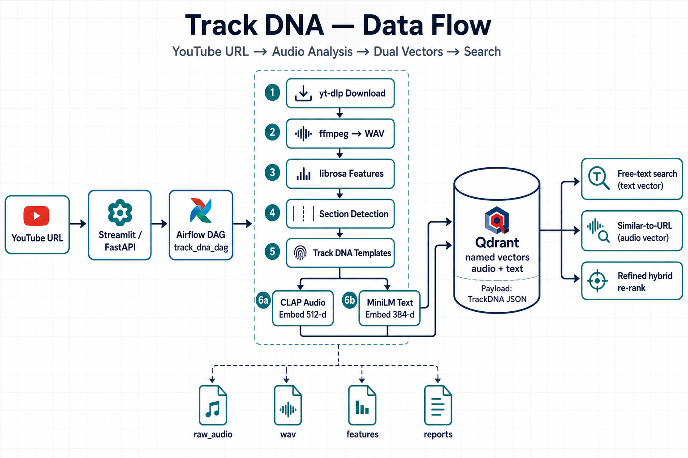
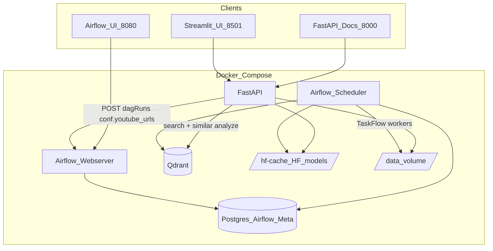
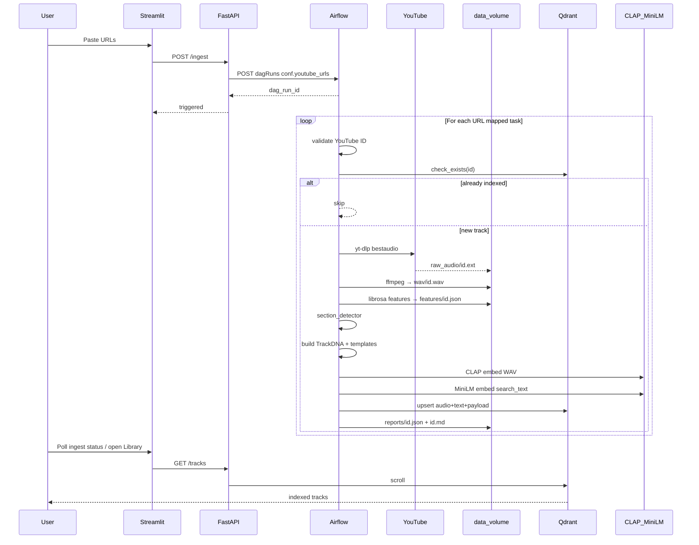
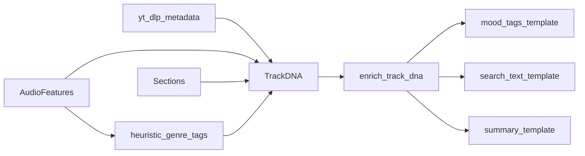
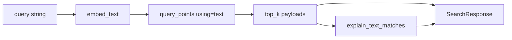
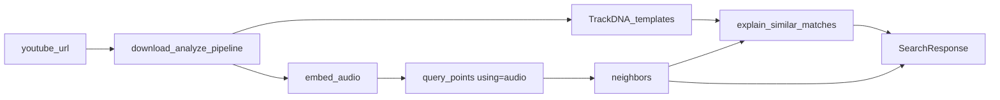
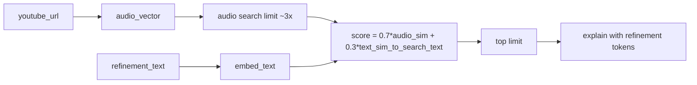
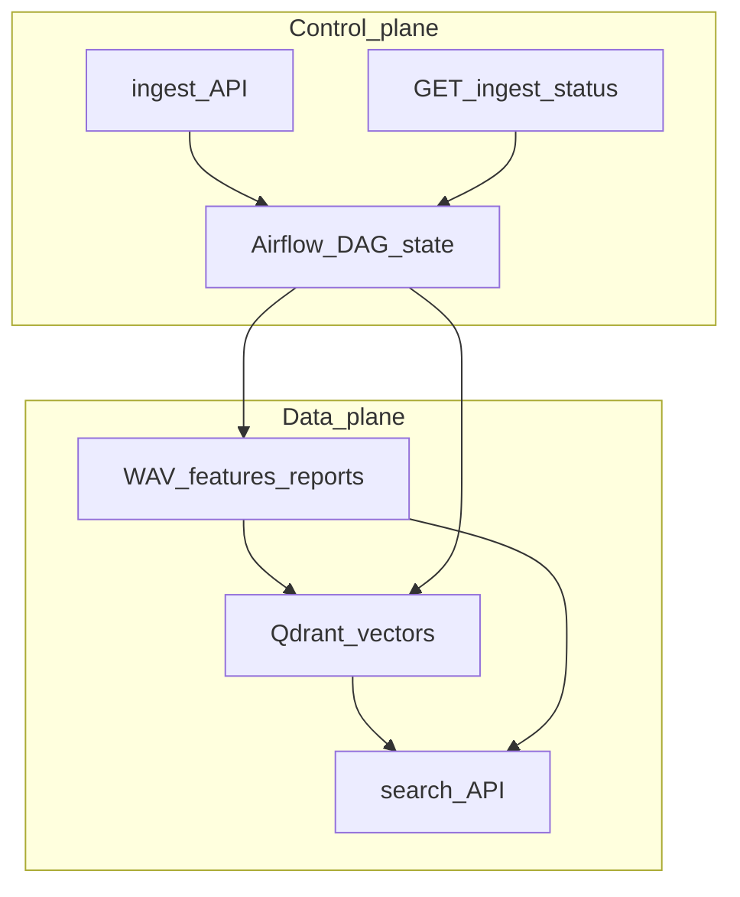

# Detailed Design — Data Flow (YouTube URL → Output)

This document explains **how data moves** through Electronic Track DNA Analyzer: from a YouTube link to Track DNA files, Qdrant vectors, and search responses.



---

## 1. System context



| Concern | Component | Responsibility |
|---------|-----------|----------------|
| Trigger ingest | FastAPI `POST /ingest` | Auth to Airflow REST, pass URL list |
| Batch analyze | Airflow `track_dna_dag` | Download → features → DNA → dual embed → store |
| Interactive search | FastAPI `/search/*` | Embed query / analyze URL → Qdrant → explain |
| UX | Streamlit | Thin HTTP client over FastAPI |
| Vectors + payload | Qdrant collection `track_dna` | Named vectors `audio`, `text` + TrackDNA JSON |
| Artifacts | `data/` | `raw_audio/`, `wav/`, `features/`, `reports/` |

---

## 2. End-to-end ingest flow (happy path)

Triggered by Streamlit **Ingest** or `POST /ingest` with body `{"urls": ["https://youtube.com/watch?v=..."]}`.



### Stage-by-stage

#### Stage A — API trigger

| Item | Detail |
|------|--------|
| Input | `IngestRequest.urls: list[str]` |
| Action | `POST {AIRFLOW}/api/v1/dags/track_dna_dag/dagRuns` with `{"conf": {"youtube_urls": [...]}}` |
| Output | `dag_run_id` for status polling |
| Code | [`api/main.py`](../api/main.py) |

Airflow does **not** receive URLs via DAG `params` alone when triggered from the API — the DAG reads `dag_run.conf["youtube_urls"]` (with params as fallback for manual UI triggers).

#### Stage B — Validate (`validate_urls`)

| Item | Detail |
|------|--------|
| Input | URL strings from conf |
| Transform | Regex extract 11-char YouTube ID ([`downloader.extract_youtube_id`](../src/downloader.py)) |
| Gate | [`qdrant_store.check_exists`](../src/qdrant_store.py) — deterministic point id from SHA-256(youtube_id) |
| Output | List of URLs still needing work (feeds `.expand`) |

#### Stage C — Download + convert (`download_audio`)

| Item | Detail |
|------|--------|
| Tool | yt-dlp `bestaudio/best` → `data/raw_audio/{id}.*` |
| Convert | ffmpeg → mono, 22050 Hz, s16 → `data/wav/{id}.wav` |
| Output dict | `youtube_id`, `youtube_url`, `title`, `artist`, `duration`, `raw_path`, `wav_path` |

WAV at 22.05 kHz is the **feature-extraction** contract. CLAP later reloads audio at **48 kHz** from the same file (librosa resample).

#### Stage D — Features (`extract_features`)

| Field | Source (librosa) | Why it matters |
|-------|------------------|----------------|
| `tempo_bpm` | `beat_track` | Genre heuristics + search explanations |
| `energy_mean` / `energy_std` | RMS | Loudness / dynamic vs hypnotic |
| `spectral_centroid_mean` | spectral centroid | “dark” vs “bright” |
| `spectral_bandwidth_mean`, `spectral_rolloff_mean` | spectral | Timbre |
| `mfcc_means` (13) | MFCC | Timbral fingerprint in payload |
| `chroma_means` (12) | chroma | Pitch-class profile in payload |
| `zero_crossing_rate` | ZCR | Noisiness / percussiveness proxy |
| `onset_rate` | onset detect / duration | Percussive vs minimal |
| `duration_seconds` | length | Structure context |
| `loudness_db` | 20·log10(RMS) approx | Not true LUFS; relative level |

Persisted: `data/features/{id}.json`.

#### Stage E — Sections (`detect_sections`)

| Step | Logic |
|------|--------|
| Frame | ~4 s RMS energy, ceiling frame count so tail is included |
| Smooth | Moving average |
| Boundaries | Large energy derivative → cut |
| Labels | Position + energy: intro / buildup / drop / breakdown / outro |

Output: `list[Section]` with `start_sec`, `end_sec`, `energy_level`. Enables queries like “long intro”.

#### Stage F — Track DNA + templates (`build_track_dna`)



| Field | Origin |
|-------|--------|
| `genre_tags` | BPM windows + spectral/onset heuristics |
| `mood_tags` | Energy/spectral/section heuristics ([`text_generator`](../src/text_generator.py)) |
| `search_text` | Natural-language paragraph built from BPM, tone, rhythm, structure, tags |
| `summary` | Short DJ-facing report string |

**No LLM.** Templates keep text aligned with measured features.

#### Stage G — Dual embedding + Qdrant (`embed_and_store`)

| Vector | Model | Dim | Input | Qdrant name |
|--------|-------|-----|-------|-------------|
| Audio | CLAP `laion/larger_clap_music_and_speech` | 512 | WAV (≤30 s centered window @ 48 kHz) | `audio` |
| Text | `all-MiniLM-L6-v2` | 384 | `search_text` | `text` |

Point id = `int(sha256(youtube_id)[:8]) % 2^63`. Payload = full TrackDNA JSON (+ `youtube_id`).

Models lazy-load once per process; weights live under `HF_HOME=/hf-cache`.

#### Stage H — Reports (`save_reports`)

| File | Content |
|------|---------|
| `data/reports/{id}.json` | Full TrackDNA |
| `data/reports/{id}.md` | Human-readable tables (features, sections, tags) |

#### Stage I — Cleanup audio (`cleanup_audio`)

After reports succeed, delete `data/raw_audio/{id}.*` and `data/wav/{id}.wav`.  
Qdrant vectors + report files remain. Search never needs the WAV after embed.

Similar-to-URL search also deletes query audio in a `finally` after analysis.

---

## 3. Search flows (API → output)

Search does **not** go through Airflow (except that the library was filled by the DAG).

### 3.1 Free-text — `POST /search/text`



| Step | Detail |
|------|--------|
| Embed | MiniLM on user query |
| Retrieve | Cosine search on named vector `text` |
| Explain | Keyword overlap with tags/search_text + feature cues (intro length, dark centroid, etc.) |
| Response | `SearchResult[]` + shared explanation string + `query_description` |

### 3.2 Similar-to-YouTube — `POST /search/similar`



Inline path reuses the same modules as the DAG (`download_audio` → features → sections → `build_track_dna` → `embed_audio`) but **does not require** writing to Qdrant for the query track (unless you ingest it separately).

Explanations: BPM / energy / spectral **deltas** vs query track features.

### 3.3 Similar + refinement — `POST /search/similar-refined`



Design intent: **audio finds the neighborhood**; **text steers** (“darker”, “less vocal”) without inventing a single fused vector of mismatched dimensions.

---

## 4. Data artifacts on disk

```text
data/
├── raw_audio/     # yt-dlp output (webm/m4a/…)
├── wav/           # canonical mono WAV per youtube_id
├── features/      # AudioFeatures JSON
└── reports/       # TrackDNA JSON + Markdown
```

| Artifact | Producer | Consumers |
|----------|----------|-----------|
| WAV | downloader | librosa features, section detector, CLAP |
| features JSON | audio_features | debugging / optional reprocessing |
| reports | track_dna.save_track_dna | humans, portfolio demos |
| Qdrant points | embed_and_store | all search modes, Library |

---

## 5. Qdrant logical model

```text
Collection: track_dna
├── vectors
│   ├── audio: float32[512]   # CLAP, cosine
│   └── text:  float32[384]   # MiniLM, cosine
└── payload
    ├── youtube_id, youtube_url, title, artist
    ├── features { … }
    ├── sections [ { label, start_sec, end_sec, energy_level } ]
    ├── genre_tags[], mood_tags[]
    ├── search_text, summary
    └── analyzed_at
```

**Migration note:** Older single-vector (Ollama 768-d) collections are incompatible. Wipe `qdrant-data` volume when upgrading.

---

## 6. Control vs data plane



- **Control plane:** DAG run state in Postgres (via Airflow).  
- **Data plane:** files + Qdrant. Search never needs DAG state if vectors already exist.

---

## 7. Failure and edge cases

| Scenario | Behavior |
|----------|----------|
| Invalid URL | Dropped in `validate_urls` with warning |
| Already indexed | Skipped (idempotent ingest) |
| yt-dlp / geo / age gate failure | Task fails; Airflow retries per default_args |
| Empty mapped URL list | No downstream mapped tasks |
| Qdrant down at search | API 500 |
| Airflow down at ingest | API 503 |
| First CLAP load | Slow download into `/hf-cache`; later runs warm |
| Hour-long mix | CLAP uses centered ≤30 s window — snippet bias |

---

## 8. Module map (code → stage)

| Module | Stage |
|--------|--------|
| [`api/main.py`](../api/main.py) | Trigger, status, search HTTP |
| [`dags/track_dna_dag.py`](../dags/track_dna_dag.py) | Orchestration / mapping |
| [`src/downloader.py`](../src/downloader.py) | URL → raw + WAV |
| [`src/audio_features.py`](../src/audio_features.py) | WAV → AudioFeatures |
| [`src/section_detector.py`](../src/section_detector.py) | WAV → sections |
| [`src/track_dna.py`](../src/track_dna.py) | Assemble + persist reports |
| [`src/text_generator.py`](../src/text_generator.py) | Tags / search_text / summary |
| [`src/embeddings.py`](../src/embeddings.py) | CLAP + MiniLM |
| [`src/qdrant_store.py`](../src/qdrant_store.py) | Collection / upsert / query |
| [`src/search.py`](../src/search.py) | Three search modes |
| [`src/explain.py`](../src/explain.py) | Structured explanations |
| [`ui/app.py`](../ui/app.py) | UX over API |

---

## 9. One-sentence summary

**A YouTube URL becomes a WAV; the WAV becomes measurable Track DNA and template text; CLAP and MiniLM turn DNA into two Qdrant vectors; search either embeds language into the text space or re-analyzes a URL into the audio space — with explanations grounded in features, not a chat LLM.**
