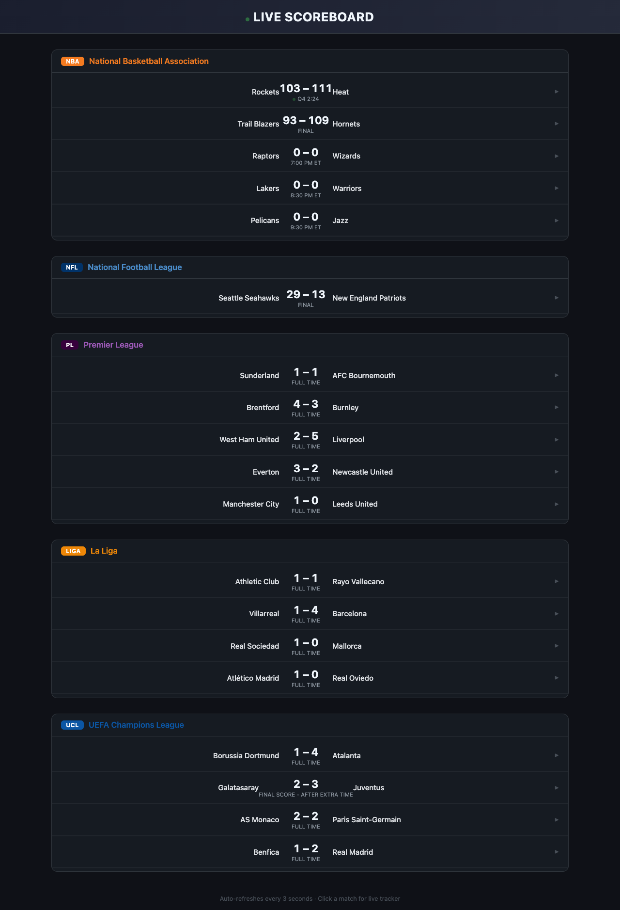
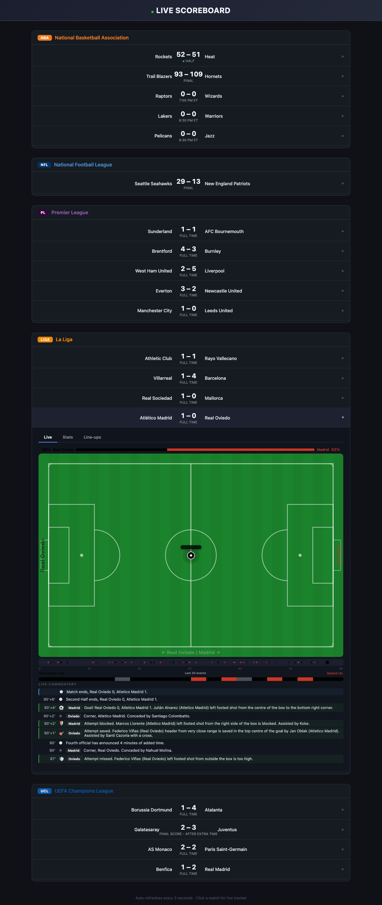
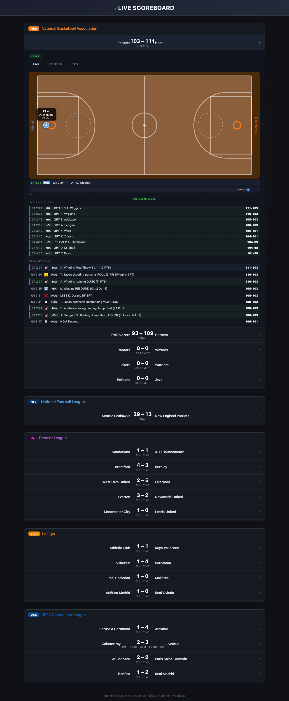

# Real-Time Multi-Sport Scoreboard Platform

Slide-by-slide content matching `scoreboard_presentation.pptx` (12 slides).

---

## Slide 1 -- Title

# Real-Time Multi-Sport Scoreboard

**A Streaming Data Engineering Platform**

NBA | NFL | Premier League | La Liga | Champions League

Apache Kafka + PySpark Structured Streaming + PostgreSQL + Flask + Docker Compose

14 services | 5 Kafka topics | 4 database tables | 3 parallel pipelines

---

## Slide 2 -- Problem & Goals

### The Problem

- Sports data generated in real time across multiple leagues, APIs, and formats
- Different consumers need different views: fans want live scores, analysts want SQL-queryable data
- Must decouple producers from consumers and handle bursty concurrent updates
- APIs have rate limits -- need caching, deduplication, and smart polling

### Three Parallel Pipelines

**Pipeline 1 -- Live Scoreboard UI**
```
Sources -> Kafka -> Flask -> Browser (3s refresh)
```

**Pipeline 2 -- Streaming Analytics**
```
Sources -> Kafka -> PySpark -> PostgreSQL (3 tables)
```

**Pipeline 3 -- Batch Player Stats**
```
ESPN/nba_api -> psycopg2 -> PostgreSQL (every 6h)
```

---

## Slide 3 -- Supported Leagues & Data Sources

| League | Sport | Data Source | Cost |
|--------|-------|------------|------|
| NBA | Basketball | nba_api Python SDK + ESPN | Free |
| NFL | American Football | ESPN REST API | Free |
| Premier League | Soccer (England) | ESPN REST API | Free |
| La Liga | Soccer (Spain) | ESPN REST API | Free |
| Champions League | Soccer (Europe) | ESPN REST API | Free |

- All data sources are **FREE with no API keys required**
- ESPN endpoints: `site.api.espn.com/apis/site/v2/sports/{sport}/{league}/scoreboard`
- Match details: `.../summary?event={id}` -- goals, cards, subs, commentary, lineups, 20+ stats
- Dynamic cache TTL: 3s for live soccer, 5s for live NFL, 30s for finished games

---

## Slide 4 -- System Architecture

```
                        DATA SOURCES
    nba_api       ESPN NFL      ESPN PL      ESPN Liga     ESPN UCL
       |              |              |              |              |
       v              v              v              v              v
                   KAFKA PRODUCERS (Python, 3-10s intervals)
                   Enriched messages: scores + events + stats + lineups
       |              |              |              |              |
       v              v              v              v              v
  [nba_scores]  [nfl_scores]  [pl_scores]  [liga_scores]  [cl_scores]
                              |
              +---------------+----------------+
              v                                v
   FLASK SCOREBOARD UI              PYSPARK STRUCTURED STREAMING
   + Match Trackers                 foreachBatch -> 3 JDBC tables
   + Tabs: Live/Stats/Lineups            |
              |                           v
              v                     PostgreSQL :5433
   Web Browser :5050                (game_scores, match_events, period_scores)

              PLAYER STATS BATCH FETCHER (every 6 hours)
              nba_api + ESPN -> psycopg2 -> PostgreSQL (player_season_stats)
```

---

## Slide 5 -- Technology Stack

| Technology | Version | Role |
|-----------|---------|------|
| Python | 3.11 | All producers, UI, Spark job, stats fetcher |
| Apache Kafka (KRaft) | 3.7.0 | Event streaming, topic-based pub/sub, no ZooKeeper |
| Apache Spark | 3.5.0 | Structured Streaming, micro-batch to PostgreSQL |
| PostgreSQL | 16 | Persistent analytics store (4 tables) |
| Flask | 3.x | Scoreboard UI backend with background Kafka consumer |
| kafka-python-ng | 2.x | Producer + consumer library with retry/backoff |
| Docker Compose | v2 | Full-stack orchestration -- 14 services |
| Kafka UI | 0.7.2 | Topic and consumer group monitoring |

Key choice: Kafka in KRaft mode (no ZooKeeper) -- single-node broker with combined controller, simpler deployment.

---

## Slide 6 -- Kafka Layer & Enriched Message Schema

### 5 Kafka Topics

| Topic | Producer |
|-------|----------|
| `nba_scores` | `nba/producer.py` |
| `nfl_scores` | `nfl/producer.py` |
| `premier_league_scores` | `premier_league/producer.py` |
| `la_liga_scores` | `la_liga/producer.py` |
| `champions_league_scores` | `champions_league/producer.py` |

### Fingerprint Deduplication

Only publishes when scores, statuses, or play counts actually change. Avoids flooding Kafka with identical data.

### Unified Enriched Message Schema

```json
{
  "league": "premier_league",
  "games": [{
    "gameId": "672341",
    "statusText": "Second Half - 67'",
    "homeTeam": {"teamName": "Liverpool", "score": 2},
    "awayTeam": {"teamName": "Man City", "score": 1},
    "periods": [...],
    "events": [{"type": "goal", "minute": 23, "player": "Salah", "team": "Liverpool"}],
    "stats": {"possession": ["62.3", "37.7"], "shots": ["15", "7"], ...20+ fields},
    "plays": [{"minute": "67'", "text": "Goal! Salah header...", "type": "goal"}],
    "lineups": [{"team": "Liverpool", "color": "#C8102E", "formation": "4-3-3", "players": [...]}]
  }]
}
```

---

## Slide 7 -- Live Scoreboard UI

### Dark-themed web interface at `http://localhost:5050`



- 5 league sections with live scores
- Click any match to expand into tabbed detail panel
- Auto-refreshes every 3 seconds
- Background Kafka consumer thread keeps data in memory

---

## Slide 8 -- Live Match Tracker Deep Dive




### Features

- SVG pitch/court/field with animated ball (BallController)
- Smooth CSS cubic-bezier transitions between positions
- Possession indicator, momentum timeline, live commentary feed
- Text-based position inference from ESPN commentary data
- Tabbed interface: Live, Stats (20+ fields), Line-ups, Box Score (NBA), Drives (NFL)

### Free Data Limitation

| Aspect | Current (Free) | Production (Paid) |
|--------|---------------|-------------------|
| Ball Position | Text inference (~60-70%) | Real x,y coordinates (100%) |
| Update Frequency | 3-5 seconds | Sub-second |
| Player Positions | Not available | Full tracking |
| Providers | ESPN, nba_api | Sportradar, Opta, Genius Sports |

**The #1 bottleneck for live tracker quality is the data source, not the code.**

---

## Slide 9 -- Spark Streaming to PostgreSQL

### Pipeline Stages

1. **Read** -- Spark Structured Streaming subscribes to all 5 Kafka topics
2. **Parse** -- JSON deserialized with enhanced schema (games + events + periods)
3. **Transform** -- `explode()` flattens into rows for each destination table
4. **Write** -- `foreachBatch` writes to 3 PostgreSQL tables via JDBC

### Target Tables

| Table | What It Stores |
|-------|---------------|
| `game_scores` | Score snapshots (append-only time series) |
| `match_events` | Goals, cards, substitutions (soccer) |
| `period_scores` | Quarter/half score breakdowns |

### Configuration

| Parameter | Value |
|-----------|-------|
| Trigger | `processingTime = 10 seconds` |
| Checkpoint | `/tmp/spark_checkpoint/scoreboard_v2` |
| Spark Master | `spark://spark-master:7077` |
| JARs | Pre-downloaded at Docker build time (no Maven at runtime) |

---

## Slide 10 -- Code Quality & Engineering Practices

| Practice | Detail |
|----------|--------|
| Shared Soccer Engine (DRY) | 3 league producers are 12-line wrappers around `shared/soccer_producer.py` -- eliminates ~500 lines of duplication |
| Structured Logging | All Python files use the `logging` module with timestamps and severity levels |
| Docstrings & Constants | Every public function documented; magic numbers extracted to named constants |
| Pinned Dependencies | All 8 `requirements.txt` files use version range pins (`>=x,<y`) |
| HTML Escaping (XSS) | `escapeHtml()` applied to 40+ dynamic content insertions in the frontend |
| Kafka Retry with Backoff | Consumer wraps in while-True with exponential backoff (3s to 30s max) |
| Specific Exception Handling | `requests.RequestException`, `json.JSONDecodeError`, `KeyError` instead of bare `except` |
| Docker Image Pinning | `kafka:3.7.0`, `kafka-ui:v0.7.2`, `postgres:16`, `spark:3.5.0` -- no `:latest` tags |

**Code Review Score: 8.5 / 10**

---

## Slide 11 -- Production Scaling & Future Work

### Production Requirements

| Area | Detail |
|------|--------|
| Paid Data Providers | Sportradar, Opta, Genius Sports for real-time x,y coordinate tracking |
| WebSocket / SSE | Replace HTTP polling with push-based updates for lower latency |
| Redis State Store | Cache live match state for instant reads, pub/sub fanout to multiple UI instances |
| Grafana Dashboards | Connect to PostgreSQL for real-time analytics visualization and alerting |

### Future Development

| Area | Detail |
|------|--------|
| ML Predictions | Win probability models trained on historical score progression data |
| Horizontal Scaling | Kafka partitions, Spark workers, load-balanced Flask instances |
| CI/CD Pipeline | GitHub Actions: lint, test, build images, push to container registry |
| More Leagues | Bundesliga, Serie A, MLS, MLB, NHL -- architecture supports any league |

**Key Insight**: The #1 bottleneck for live tracker quality is the data source, not the code. Free ESPN text data achieves ~60-70% tracker accuracy. Paid coordinate feeds (Sportradar/Opta) would bring it to 100%.

---

## Slide 12 -- Summary

### Key Takeaways

- Event-driven architecture with Kafka decouples 5 producers from 3 consumers
- Unified enriched JSON schema normalizes heterogeneous data sources
- Live match tracker with animated ball, possession, momentum, and commentary
- PySpark Structured Streaming writes to PostgreSQL in 10-second micro-batches
- Code quality score: 8.5/10 -- logging, docstrings, DRY, pinned deps, XSS prevention
- 14 Docker Compose services, single command to run the entire platform
- Free data sources reach ~60-70% tracker accuracy; paid feeds unlock 100%

### How to Run

```bash
docker compose up -d --build
```

| Service | URL |
|---------|-----|
| Scoreboard | http://localhost:5050 |
| Kafka UI | http://localhost:8080 |
| PostgreSQL | localhost:5433 (db: scoreboard, user: scoreboard, pass: scoreboard) |

GitHub: github.com/dreamgroup-il/nba-proj

---

*End of Presentation*
