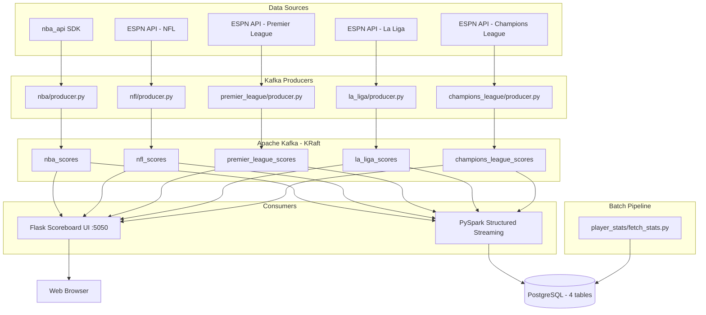
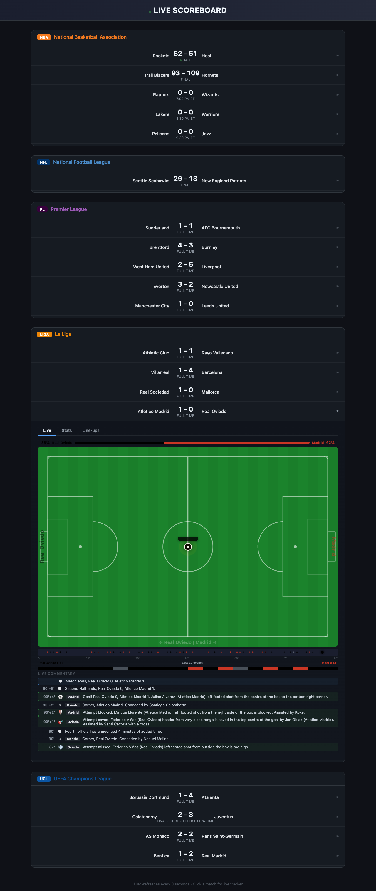
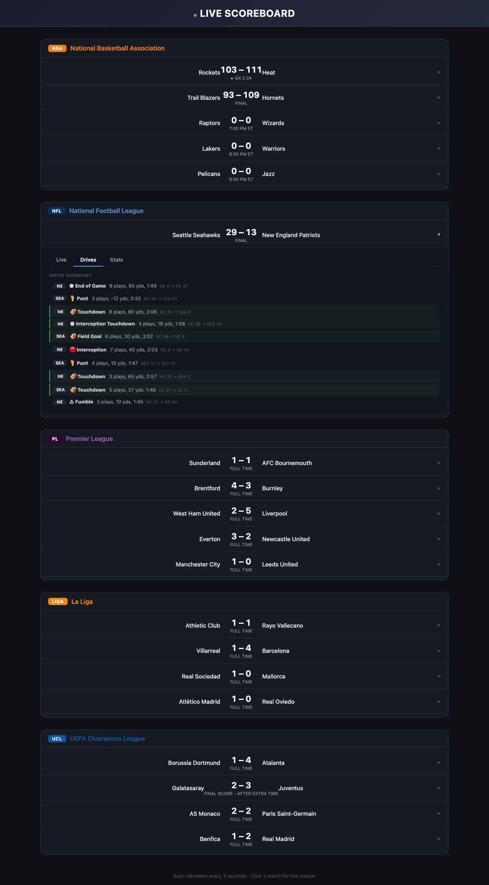

# Real-Time Multi-Sport Scoreboard Platform

A streaming data engineering platform that ingests live sports data from 5 major leagues, streams it through Apache Kafka, and serves it to three parallel consumers: a live web scoreboard with animated match trackers, a PySpark streaming pipeline writing to PostgreSQL, and a batch player statistics aggregator.


---

## Features

- **5 Leagues**: NBA, NFL, Premier League, La Liga, UEFA Champions League
- **Live Match Tracker**: SVG pitch/court/field visualization with animated ball movement, possession indicators, momentum timeline, and real-time commentary
- **Tabbed Match Detail**: Live tracker, Stats (20+ fields for soccer), Line-ups (with formations and substitution tracking), Box Score (NBA), Drives (NFL)
- **Three Parallel Pipelines** from one Kafka stream:
  1. Flask web UI with 3-second auto-refresh
  2. PySpark Structured Streaming to PostgreSQL (3 tables)
  3. Batch player season stats (every 6 hours)
- **14 Docker Compose Services** -- single `docker compose up -d` to run everything
- **Enriched Kafka Messages** -- unified JSON schema with scores, events, stats, lineups, plays, commentary, team colors, and formations
- **Fingerprint Deduplication** -- only publishes to Kafka when data actually changes
- **Code Quality** -- logging, docstrings, pinned dependencies, HTML escaping (XSS prevention), shared soccer engine (DRY)

---

## Architecture



---

## Screenshots

| Main Scoreboard | Soccer Live Tracker | NBA Live Tracker |
|---|---|---|
|  |  |  |

| Stats Tab | Lineups Tab | NFL Drives |
|---|---|---|
|  |  |  |

---

## Quick Start

```bash
git clone https://github.com/amirganmor/My_Projs.git
cd live_scoreboard
docker compose up -d --build
```

Wait ~30 seconds for Kafka to become healthy and producers to start fetching data, then open:

| Service | URL / Connection |
|---|---|
| **Live Scoreboard** | http://localhost:5050 |
| **Kafka UI** | http://localhost:8080 |
| **PostgreSQL** | `localhost:5433` (db: `scoreboard`, user: `scoreboard`, pass: `scoreboard`) |
| **Spark Master UI** | http://localhost:8081 |

To stop everything:

```bash
docker compose down       # keeps database data
docker compose down -v    # wipes database data (clean start)
```

---

## Technology Stack

| Layer | Technology | Version |
|---|---|---|
| Language | Python | 3.11 |
| Message Broker | Apache Kafka (KRaft) | 3.7.0 |
| Stream Processing | Apache Spark | 3.5.0 |
| Database | PostgreSQL | 16 |
| Web Framework | Flask | 3.x |
| Kafka Client | kafka-python-ng | 2.x |
| Containerization | Docker Compose | v2 |
| Monitoring | Kafka UI | 0.7.2 |

---

## Project Structure

```
scoreboard/
├── docker-compose.yaml              # 14 services
├── init.sql                         # 4 tables + indexes + constraints
├── shared/
│   └── soccer_producer.py           # Shared engine for all soccer leagues
├── nba/
│   ├── producer.py                  # nba_api + ESPN coordinates
│   ├── Dockerfile
│   └── samples/
├── nfl/
│   ├── producer.py                  # ESPN + drive/play-by-play
│   ├── Dockerfile
│   └── samples/
├── premier_league/
│   ├── producer.py                  # Thin wrapper -> SoccerEngine
│   ├── Dockerfile
│   └── samples/
├── la_liga/                         # Same pattern as premier_league
├── champions_league/                # Same pattern as premier_league
├── scoreboard_ui/
│   ├── app.py                       # Flask + background Kafka consumer
│   └── templates/
│       └── index.html               # Full UI with live match trackers
├── spark_analytics/
│   └── stream_to_postgres.py        # PySpark -> 3 PostgreSQL tables
└── player_stats/
    └── fetch_stats.py               # Batch: nba_api + ESPN -> PostgreSQL
```

---

## Database Schema

4 PostgreSQL tables:

- **`game_scores`** -- Append-only score snapshots (time series)
- **`match_events`** -- Goals, cards, substitutions (soccer)
- **`period_scores`** -- Quarter/half score breakdowns (all sports)
- **`player_season_stats`** -- Season aggregates with JSONB stats

See [DATABASE_SCHEMA.md](DATABASE_SCHEMA.md) for full column definitions and example queries.

---

## Data Sources

| League | Source | Type | Cost |
|---|---|---|---|
| NBA | `nba_api` Python SDK + ESPN API | SDK + REST | Free |
| NFL | ESPN API | REST | Free |
| Premier League | ESPN API | REST | Free |
| La Liga | ESPN API | REST | Free |
| Champions League | ESPN API | REST | Free |

All data sources are **free and require no API keys**. The live match tracker uses text-based position inference from ESPN commentary data, which provides approximately 60-70% positional accuracy. Professional-grade trackers (365Scores, LiveScore) use paid coordinate feeds from providers like Sportradar or Opta for 100% accuracy with sub-second updates.

---

## Live Match Tracker

The platform includes animated match trackers for all three sports:

- **Soccer**: SVG pitch with animated ball (BallController), smooth CSS transitions, text-based position estimation from ESPN play descriptions, possession indicator, momentum timeline
- **NBA**: SVG half-court with ball position derived from ESPN coordinate data, scoring play timeline, box score, team stats
- **NFL**: SVG football field with drive visualization, yard-line markers, scoring play timeline, drive summaries

The ball animation system uses a persistent `BallController` JavaScript class that manages DOM elements independently of UI re-renders, with cubic-bezier interpolation for smooth transitions.

### Free vs. Paid Data Sources

| Aspect | Current (Free) | Production (Paid) |
|---|---|---|
| Ball Position | Text inference (~60-70%) | Real x,y coordinates (100%) |
| Update Frequency | 3-5 seconds | Sub-second |
| Player Positions | Not available | Full tracking |
| Providers | ESPN, nba_api | Sportradar, Opta, Genius Sports |

---

## Future Development

- **Paid Data Providers** -- Sportradar LMT widget or Opta feed for real-time coordinate tracking
- **WebSocket/SSE** -- Replace HTTP polling with push-based updates for lower latency
- **Redis State Store** -- Cache live match state for faster reads and horizontal scaling
- **Grafana Dashboards** -- Connect to PostgreSQL for real-time analytics visualization
- **ML Predictions** -- Win probability models trained on historical score progression data
- **Horizontal Scaling** -- Kafka partitions, Spark workers, load-balanced Flask instances
- **CI/CD** -- GitHub Actions for lint, test, build, and push to container registry
- **Additional Leagues** -- Bundesliga, Serie A, MLS, MLB, NHL (architecture supports any league with a public API)

---
