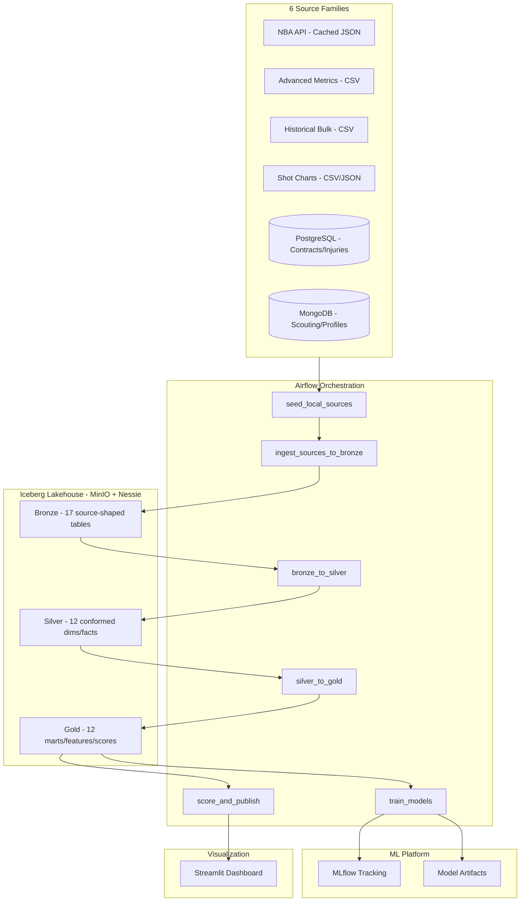

# NBA Athlete Performance Lakehouse

A fully local, production-grade NBA analytics platform that merges **6 heterogeneous data source families** into a unified **Apache Iceberg lakehouse** with **bronze/silver/gold medallion architecture**, trains ML models, and produces actionable player insights — all running with a single `docker compose up --build`.

## Why This Project

- Demonstrates realistic **multi-source data engineering** (API, file, SQL, NoSQL)
- Implements a complete **Iceberg lakehouse** with Nessie catalog on MinIO
- Shows **entity resolution** across disparate NBA data systems
- Includes **ML training + scoring** with MLflow experiment tracking
- Fully local — **zero cloud dependencies**, runs on a normal laptop
- Portfolio-ready and YouTube-demo-friendly

## Architecture



## Services

| Service | URL | Credentials |
|---------|-----|-------------|
| **Airflow** | http://localhost:8080 | admin / admin |
| **MinIO Console** | http://localhost:9001 | minioadmin / minioadmin123 |
| **MLflow** | http://localhost:5001 | — |
| **Streamlit Dashboard** | http://localhost:8501 | — |
| **Nessie** | http://localhost:19120 | — |
| **PostgreSQL** | localhost:5432 | lakehouse / lakehouse123 |
| **MongoDB** | localhost:27017 | mongo / mongo123 |

## Quick Start

### Step 1: Pre-fetch Real NBA Data

```bash
pip install nba_api tqdm pandas requests
python scripts/fetch_real_nba_data.py --skip-existing
```

This fetches **all NBA players across 20 seasons** (2004-05 → 2024-25) from the NBA stats API, plus salary data from public sources. Takes ~45-90 minutes. Results are cached under `data/seed/` for fully offline operation afterward.

### Step 2: Start Everything

```bash
cp .env.example .env
docker compose up --build -d
```

### Step 3: Run the Pipeline

```bash
make trigger-all
```

Or trigger each DAG individually through the Airflow UI.

## Multi-Source NBA Data Architecture

This project intentionally models **6 realistic NBA data source families** to demonstrate real-world data engineering challenges:

| # | Source Family | Type | Description | Bronze Tables |
|---|-------------|------|-------------|--------------|
| 1 | **NBA API Stats** | API (cached JSON) | Official-style player stats, game logs, standings | `nba_api_players`, `nba_api_teams`, `nba_api_player_season_stats`, `nba_api_player_gamelogs`, `nba_api_games`, `nba_api_standings` |
| 2 | **Advanced Metrics** | File (CSV) | PER, TS%, USG%, OFF/DEF ratings | `advanced_player_metrics` |
| 3 | **Historical Bulk** | File (CSV) | 20-season Kaggle-style bulk export | `historical_player_seasons`, `historical_box_scores`, `historical_team_standings` |
| 4 | **Shot Charts** | File (CSV/JSON) | Zone-level + raw shot data | `shot_chart_zones`, `shot_chart_details` |
| 5 | **Contracts/Injuries** | SQL (PostgreSQL) | Salary, injury, roster records | `contracts`, `injuries`, `rosters` |
| 6 | **Scouting/Profiles** | NoSQL (MongoDB) | Nested scouting reports and narratives | `mongo_player_profiles`, `mongo_scouting_reports` |

The **Silver layer** merges all 6 sources into canonical dimensions and facts with unified player/team/season IDs. The **Gold layer** builds cross-source feature tables that combine performance stats + advanced metrics + salary + injuries + shot profiles + scouting context.

## Medallion Architecture

### Bronze (17 tables)
Source-shaped raw data. Each source writes its own bronze tables preserving the original schema plus ingestion metadata (`ingestion_ts`, `source_name`, `batch_id`).

### Silver (12 tables)
Conformed, normalized entities with entity resolution:
- `dim_players` — unified player identity from API + rosters
- `dim_teams` — canonical team info with normalized abbreviations
- `fact_player_season_stats` — merged base + advanced stats
- `fact_player_contracts` — salary data linked to canonical players
- `player_source_mapping` — tracks which sources contributed per player

### Gold (12 tables)
Business-ready marts and ML outputs:
- `player_season_summary` — comprehensive cross-source player-season mart
- `features_value_model` — ML features for salary prediction
- `scores_underrated_players` — ranked undervalued players
- `scores_improvement_candidates` — ranked breakout candidates
- `scores_trade_targets` — ranked trade targets with component scores

## Analytics Use Cases

### 1. Underrated Players
Predicted market value (from performance features) vs actual salary. Players with the largest positive gap are undervalued.

### 2. Improvement Candidates
Classification model predicting which players will improve by 2+ PPG next season based on trajectory, age, efficiency trends, and injury history.

### 3. Trade Targets
Composite scoring system weighing performance (30%), contract efficiency (25%), age upside (15%), durability (10%), efficiency (10%), and scouting grade (10%).

## DAG Overview

| DAG | Purpose | Tasks |
|-----|---------|-------|
| `seed_local_sources` | Load seed data into Postgres + MongoDB | verify → seed_postgres, seed_mongo → summary |
| `ingest_sources_to_bronze` | Ingest all 6 sources to Bronze | api, files, postgres, mongo → summary |
| `bronze_to_silver` | Conform and merge into Silver | dimensions + facts + quality checks |
| `silver_to_gold` | Build Gold marts and features | summary, features, quality |
| `train_models` | Train value + improvement models | value_model, improvement_model → summary |
| `score_and_publish` | Score + export for dashboard | underrated, improvement, trade → export → summary |

## Project Structure

```
nba_data_lakehouse/
├── docker-compose.yml          # All services in one compose file
├── .env.example                # Environment variables
├── Makefile                    # Lifecycle + trigger commands
├── requirements/               # Python dependencies
├── infra/                      # Dockerfiles + init scripts
│   ├── airflow/Dockerfile
│   ├── mlflow/Dockerfile
│   ├── dashboard/Dockerfile
│   ├── postgres/init/
│   ├── mongo/init/
│   └── minio/init.sh
├── dags/                       # 6 Airflow DAGs
├── jobs/                       # Pipeline code
│   ├── common/                 # Shared utilities (spark, config, IDs)
│   ├── ingestion/              # Source → Bronze
│   ├── transformations/        # Bronze → Silver → Gold
│   ├── training/               # ML training
│   ├── scoring/                # ML scoring + trade targets
│   └── seed/                   # Seed data loading
├── apps/dashboard/             # Streamlit multi-page app
├── data/seed/                  # Cached real NBA data
├── configs/                    # YAML configuration
├── tests/                      # pytest tests
├── scripts/                    # Helper scripts
└── docs/                       # Additional documentation
```

## Data Volume (20 seasons)

| Dataset | Approximate Size |
|---------|-----------------|
| Player season stats | ~10,000 player-seasons |
| Advanced metrics | ~10,000 player-seasons |
| Player game logs | ~600K-900K rows |
| Shot chart data | ~50K-80K zone summaries |
| Salary data | ~10K-15K records |
| Scouting reports | ~3,000 documents |
| Unique players | ~4,500-5,000 |

## Troubleshooting

**Services not starting:**
```bash
docker compose down -v
docker compose up --build -d
docker compose logs -f
```

**Airflow tasks failing:**
Check scheduler logs: `docker logs nba-airflow-scheduler -f`

**MinIO connection errors:**
Ensure MinIO is healthy: `docker compose ps minio`

**Seed data missing:**
Run the fetch script: `python scripts/fetch_real_nba_data.py --skip-existing`

## Future Enhancements

- Add Trino for interactive SQL queries across the lakehouse
- Implement Great Expectations for automated data quality gates
- Add player similarity search using embeddings
- Live API refresh mode for in-season updates
- Advanced shot chart visualizations with court overlays
- Player comparison tool in the dashboard
